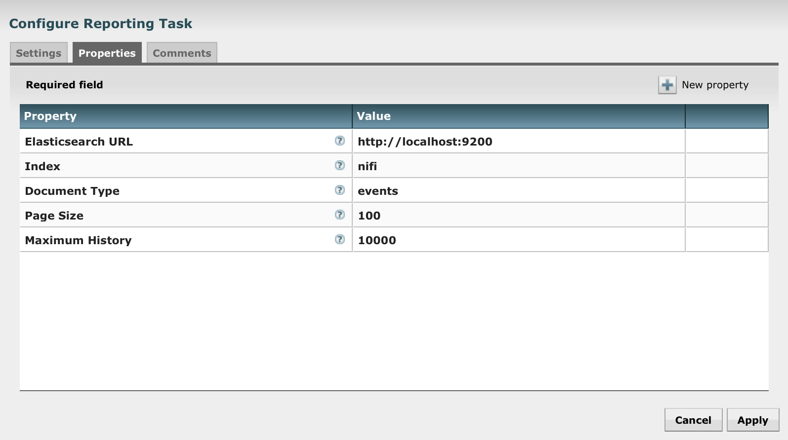
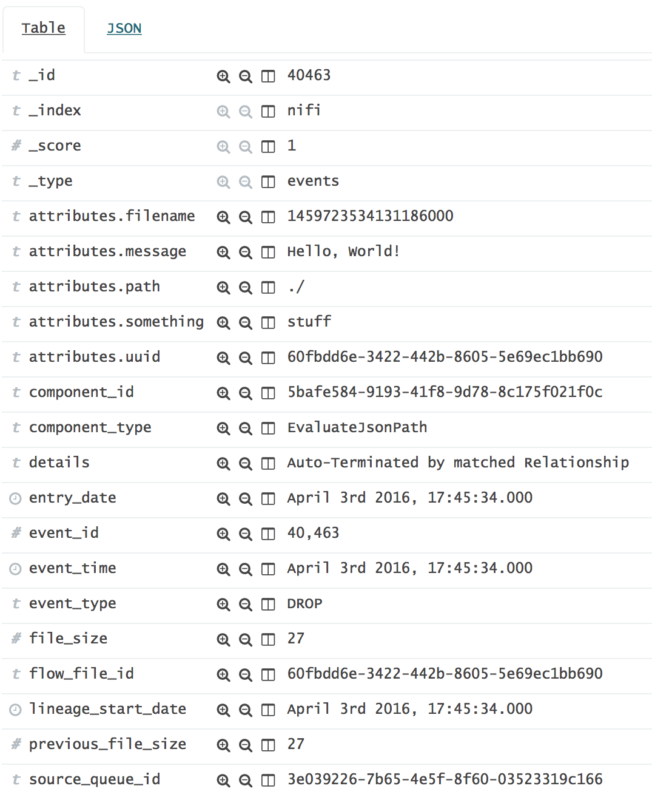
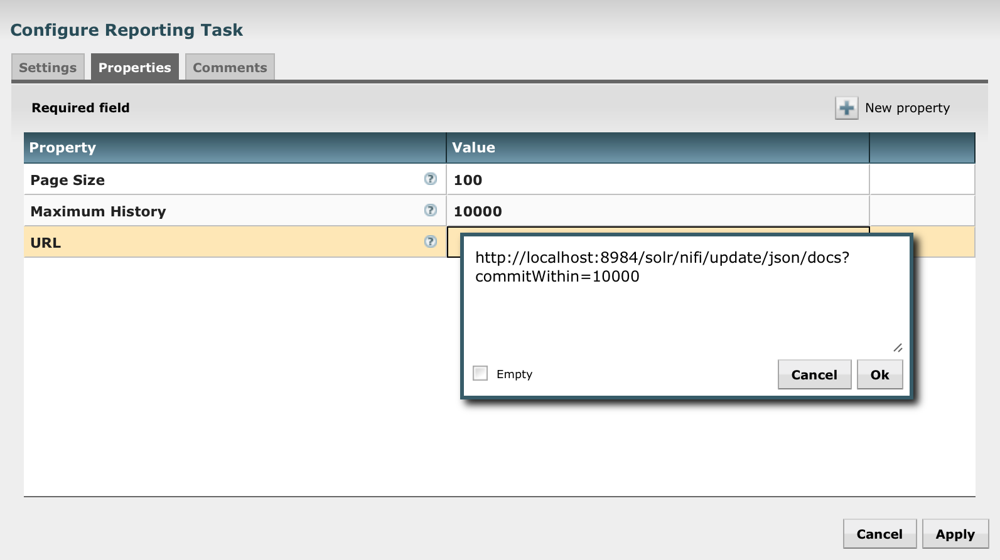

# nifi-elasticsearch-reporting-bundle

NiFi Elasticsearch reporting tasks.

## Table of Contents

- [Installation](#installation)
- [Tasks](#tasks)
    - [ElasticsearchProvenanceReporter](#elasticsearchprovenancereporter)
        - [Processor Properties](#processor-properties)
        - [Example Event](#example-event)
    - [HttpProvenanceReporter](#httpprovenancereporter)
        - [Processor Properties](#processor-properties)
- [Todo](#todo)

## Installation

```sh
$ mvn clean package
$ cp nifi-elasticsearch-reporting-nar/target/nifi-elasticsearch-reporting-nar-0.0.1-SNAPSHOT.nar $NIFI_HOME/lib
$ nifi restart
```

## Tasks

### ElasticsearchProvenanceReporter

Reporting task to write provenance events to an Elasticsearch index.

#### Reporting Task Properties



#### Example Event



### HttpProvenanceReporter

Reporting task to POST provenance events to an HTTP web service.

#### Reporting Task Properties

This reporting task can be configured to POST provenance events to an arbitrary web service. Here is an example of using it with Solr:



## Todo

- Use state management API to keep track of the most recent event indexed by ElasticsearchProvenanceReporter.
- Use event id + timestamp for document id instead of event id on its own

## License

Copyright (c) 2016 Joey Frazee. nifi-elasticsearch-reporting-bundle is released under the Apache License Version 2.0.
